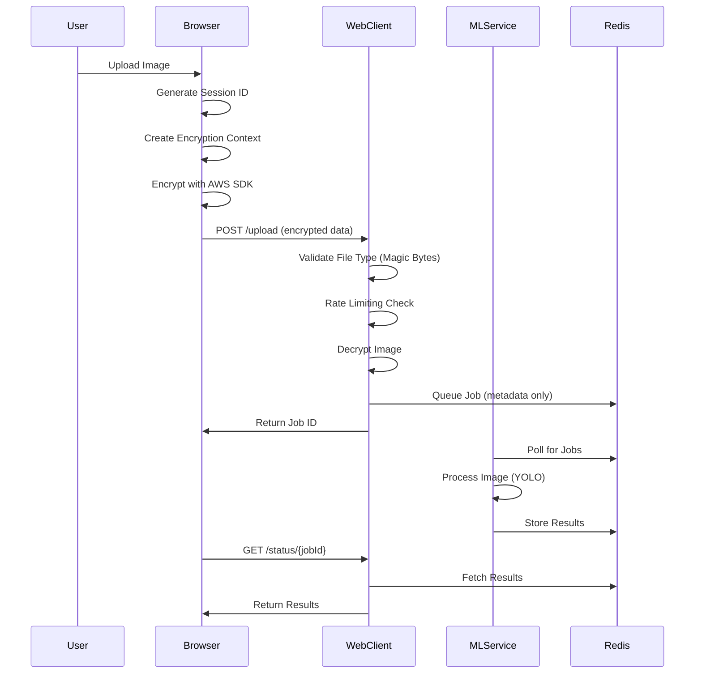

# Architecture Overview

This document explains the technical architecture of the Confidential Cat Counter, a reference implementation for privacy-preserving machine learning.

## System Overview

The Confidential Cat Counter demonstrates a privacy-by-design architecture where sensitive data (images) is encrypted client-side before leaving the user's browser, processed by a machine learning service that never sees plaintext data, and returns results through an encrypted channel.

```
┌─────────────────┐    Encrypted     ┌─────────────────┐    Plaintext    ┌─────────────────┐
│   Browser       │    Payload       │   Web Client    │    Processing   │   ML Service    │
│                 │                  │                 │                 │                 │
│ ┌─────────────┐ │       HTTPS      │ ┌─────────────┐ │      Redis      │ ┌─────────────┐ │
│ │ Encryption  │ │ ────────────────▶│ │ Decryption  │ │ ◀──────────────▶│ │    YOLO     │ │
│ │   Context   │ │                  │ │  Validation │ │                 │ │  Inference  │ │
│ │  Allowlist  │ │                  │ │   Handler   │ │                 │ │   Engine    │ │
│ └─────────────┘ │                  │ └─────────────┘ │                 │ └─────────────┘ │
└─────────────────┘                  └─────────────────┘                 └─────────────────┘
        │                                      │                                 │
        │                                      │                                 │
        ▼                                      ▼                                 ▼
┌─────────────────┐                  ┌─────────────────┐                 ┌─────────────────┐
│ AWS Encryption  │                  │  File Upload    │                 │ ONNX Runtime    │
│ SDK (Browser)   │                  │   Validation    │                 │   + Model       │
│                 │                  │   Rate Limiting │                 │   Switching     │
│ • Key Ring      │                  │   Redis Queue   │                 │                 │
│ • Context       │                  │                 │                 │                 │
│ • Base64        │                  │                 │                 │                 │
│   Chunking      │                  │                 │                 │                 │
└─────────────────┘                  └─────────────────┘                 └─────────────────┘
```

## Security Architecture

### Trust Boundaries

1. **Browser Environment** (Trusted Zone)
   - User's plaintext data exists here
   - AWS Encryption SDK performs encryption
   - Private keys never leave this environment

2. **Network Transit** (Untrusted Zone)
   - All data encrypted in transit
   - TLS provides transport security
   - Application-layer encryption provides data security

3. **Server Infrastructure** (Semi-Trusted Zone)
   - Servers can decrypt for processing
   - No persistent storage of plaintext
   - Audit logging for all operations

4. **ML Processing** (Isolated Zone)
   - Receives only decrypted data for inference
   - No network access during processing
   - Results immediately encrypted before storage

### Encryption Flow



## Component Details

### Client-Side Encryption (Browser)

**Technology Stack:**
- AWS Encryption SDK for JavaScript
- RawAesKeyringBrowser for key management
- Custom base64 chunking for large payloads

**Key Features:**
- **Encryption Context Allowlist**: Only approved metadata (session_id, upload_timestamp, file_type, processing_stage) is included
- **Base64 Chunking**: Handles large images without stack overflow
- **Fail-Closed Behavior**: Crypto failures prevent data transmission

**Implementation:**
```javascript
// Encryption context validation
const ALLOWED_CONTEXT_KEYS = [
    'session_id', 'upload_timestamp', 'file_type', 'processing_stage'
];

// Large array chunking to prevent stack overflow
function arrayToBase64Chunked(uint8Array, chunkSize = 32768) {
    const chunks = [];
    for (let i = 0; i < uint8Array.length; i += chunkSize) {
        const chunk = uint8Array.slice(i, i + chunkSize);
        chunks.push(btoa(String.fromCharCode.apply(null, chunk)));
    }
    return chunks.join('');
}
```

### Web Client (Node.js)

**Technology Stack:**
- Express.js with Helmet security middleware
- Redis for job queue management
- Multer for file upload handling

**Security Features:**
- **Content Security Policy**: Strict CSP preventing XSS
- **CORS Restrictions**: Origin allowlist configuration
- **Rate Limiting**: 100 requests per 15 minutes per IP
- **Magic Byte Validation**: File type verification beyond MIME types
- **PII Minimization**: Original filenames removed from storage

**Upload Flow:**
```javascript
// Rate limiting configuration
const uploadLimiter = rateLimit({
    windowMs: 15 * 60 * 1000, // 15 minutes
    max: 100, // limit each IP to 100 requests per windowMs
    message: { error: 'Too many uploads, please try again later' },
    standardHeaders: true,
    legacyHeaders: false
});

// Magic byte validation
const detectImageType = (buffer) => {
    if (buffer[0] === 0xFF && buffer[1] === 0xD8) return 'image/jpeg';
    if (buffer[0] === 0x89 && buffer[1] === 0x50) return 'image/png';
    // ... additional formats
};
```

### ML Service (Python)

**Technology Stack:**
- FastAPI for async API handling
- ONNX Runtime for model inference
- Redis for job coordination

**Model Support:**
- **YOLO-NAS** (Primary, Apache 2.0 licensed)
- **YOLOv5l, YOLOv8m, YOLOv11m** (Fallback options)
- Adaptive input handling for different model formats

**Processing Pipeline:**
```python
# Adaptive data type handling
def prepare_input(image, model_name):
    if 'yolov5' in model_name.lower():
        return image.astype(np.float16)
    else:  # YOLOv8, YOLOv11, YOLO-NAS
        return image.astype(np.float32)

# Model-specific input naming
input_name = 'input' if 'yolo-nas' in model_name else 'images'
```

## Data Flow Patterns

### Upload and Processing

1. **Client-Side Encryption**
   ```
   Plaintext Image → Encryption Context → AWS SDK → Encrypted Payload
   ```

2. **Server-Side Validation**
   ```
   Encrypted Payload → Rate Limit Check → Magic Byte Validation → Decryption
   ```

3. **ML Processing**
   ```
   Decrypted Image → Model Inference → Results → Redis Storage
   ```

4. **Result Retrieval**
   ```
   Job ID → Redis Lookup → Result Serialization → Client Response
   ```

### Error Handling

**Fail-Closed Principle**: All errors default to blocking the operation rather than allowing potentially unsafe fallbacks.

**Error Categories:**
- **Crypto Errors**: Browser crypto unavailable, key derivation failures
- **Validation Errors**: Invalid file types, oversized uploads, malformed requests
- **Processing Errors**: Model inference failures, resource constraints
- **Infrastructure Errors**: Redis unavailable, service timeouts

## Security Considerations

### Threat Model

**Protected Against:**
- Network eavesdropping (encryption in transit and at rest)
- Server-side data breaches (plaintext never persisted)
- Client-side data extraction (encryption before transmission)
- Injection attacks (input validation and sanitization)

**Not Protected Against:**
- Malicious ML models (model integrity must be verified separately)
- Compromised client environments (browser security relies on platform)
- Side-channel attacks (timing, power analysis)
- Physical access to decrypted data during processing

### Key Management

**Browser Environment:**
- Keys generated using `crypto.getRandomValues()`
- Key derivation follows AWS Encryption SDK standards
- No key persistence beyond session scope

**Server Environment:**
- Decryption keys derived from encrypted payloads
- Keys exist only in memory during processing
- Automatic key cleanup after processing completion

## Performance Characteristics

### Baseline Performance
- **Encryption**: ~50ms for 1MB image
- **Upload**: Network dependent, ~1-5s for typical images
- **ML Inference**: 130-170ms (model dependent)
- **Total Pipeline**: ~2-6s end-to-end

### Scalability Patterns
- **Horizontal Scaling**: Multiple ML service instances
- **Queue Management**: Redis-based job distribution
- **Rate Limiting**: Per-IP request throttling
- **Resource Limits**: Configurable memory and CPU constraints

## Deployment Architecture

### Container Strategy
```
┌─────────────────┐  ┌─────────────────┐  ┌─────────────────┐
│   web-client    │  │   ml-service    │  │     redis       │
│                 │  │                 │  │                 │
│ • Node.js 20    │  │ • Python 3.11   │  │ • Redis 7       │
│ • Express       │  │ • FastAPI       │  │ • Persistence   │
│ • Port 3000     │  │ • Port 8000     │  │ • Port 6379     │
└─────────────────┘  └─────────────────┘  └─────────────────┘
```

### Environment Configuration
- **Development**: Local containers with volume mounts
- **Testing**: Isolated containers with health checks
- **Production**: Orchestrated containers with secrets management

## Monitoring and Observability

### Logging Strategy
- **Structured Logging**: JSON format with consistent fields
- **Security Events**: Authentication, authorization, crypto operations
- **Performance Metrics**: Request latency, queue depth, model inference time
- **Error Tracking**: Failed operations with correlation IDs

### Health Checks
- **Service Health**: `/health` endpoints for all services
- **Dependency Health**: Redis connectivity, model availability
- **Resource Health**: Memory usage, disk space, CPU load

## Extension Points

### Adding New Models
1. Update model loading logic in `load_models()`
2. Add model-specific preprocessing in `prepare_input()`
3. Handle model-specific output formats in post-processing
4. Update health checks to include new model validation

### Adding New Encryption Algorithms
1. Extend AWS Encryption SDK configuration
2. Update browser crypto utilities
3. Modify server-side decryption handlers
4. Update encryption context validation

### Custom Authentication
1. Implement authentication middleware in web client
2. Add user context to encryption metadata
3. Update access control logic in ML service
4. Extend audit logging to include user information

## Reference Implementation Notes

This architecture serves as a **reference implementation** demonstrating patterns for privacy-preserving ML. For production deployment, consider:

- **Secrets Management**: Use proper secret management systems
- **Certificate Management**: Implement proper TLS certificate handling
- **Database Security**: Add encryption at rest for persistent storage
- **Access Controls**: Implement proper authentication and authorization
- **Compliance**: Ensure adherence to relevant regulatory requirements (GDPR, HIPAA, etc.)
- **Monitoring**: Implement comprehensive monitoring and alerting
- **Backup and Recovery**: Implement proper backup and disaster recovery procedures
